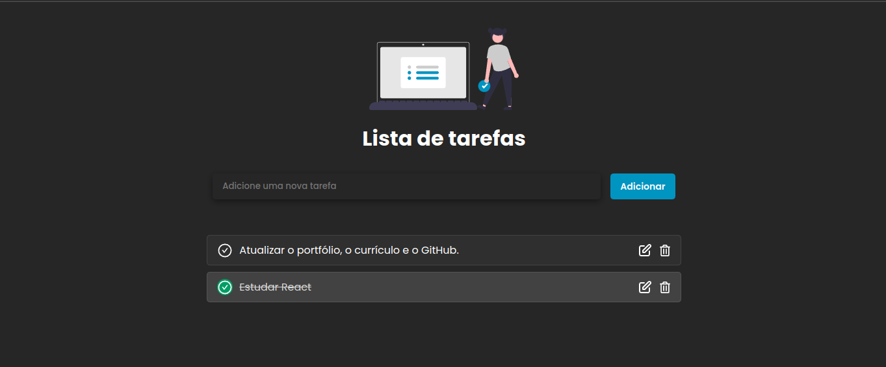

# Lista de Tarefa



## Sobre 

A lista de tarefas é uma aplicação para você planejar suas tarefas diárias. 

## Características

- Adicionar uma nova tarefa
- Marcar a tarefa como concluída
- Editar tarefa
- Excluir tarefa


## Tecnologias e ferramentas

- React
- React Icons
- React Hook Form
- React Modal
- Styled-components
- ESlint
- Prettier
- Yup

## Instalação


1. Clone o repositório
```
$ git clone https://github.com/mikasampaio/to-do-list.git
```

2. Instale as depedências
```
$ yarn add
```

3. Start o projeto
```
$  yarn start
```

## Colaborador(a) 
Mikaeli Pereira Sampaio